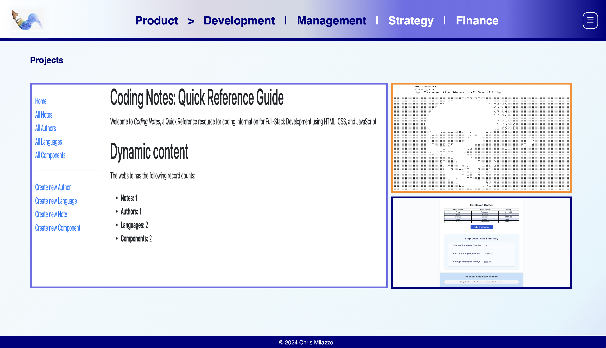

# Full-Stack Developer Bootcamp Module 02 - Challenge: Professional Portfolio

## Table of Contents

- [Background](#background)
- [Install](#install)
- [Usage](#usage)
- [Generator](#generator)
- [Badge](#badge)
- [Credit and Source Code](#credits-and-code-source)
- [Related Efforts](#related-efforts)
- [Maintainers](#maintainers)
- [Contributing](#contributing)
- [License](#license)
- [Tests](#tests)
- [GitHub Pages Location](#github-pages-location)
- [Application Screenshots](#application-screenshots) 

## Background

The Professional Portfolio is a web-based, browser-accessible site that provides an overview of the professional experience of Chris Milazzo.

the Portfolio site includes a brief experiencial overview (About), a summary of Web Development Projects (Projects), a synopsis of professional experience (Resume), and Contact page with Developer email and (inactive) Contact Form (Contact).

The Portfolio site is modern-browser compliant, and utlizes light JavaScript code to provide functonality.

## Install

The project uses HTML, CSS, and JavaScript code, and is fully-functional with any modern browser.

No additional installations, beyond a browser with JavaScript enabled, is required.

Enhanced visual functionality is available for webkit-based browsers.

## Usage

The Portfolio is a publically-available website intended to provide information regarding the professional experience and qualifications of Chris Milazzo.

## Generator

N / A

## Badge

N / A

## Credits and Code Source

Code, where referenced from a third-party Source, is noted in Comments accompanying the relevant Code lines (e.g., style.css, Line 13)

## Related Efforts

N / A

## Maintainers

N / A

## Contributing

N / A

## License

[MIT](LICENSE) © Chris Milazzo

## Tests

N / A

## GitHub Pages Location

https://meanderingbrook.github.io/02_Challenge_Professional-Portfolio-/

## Application Screenshots

